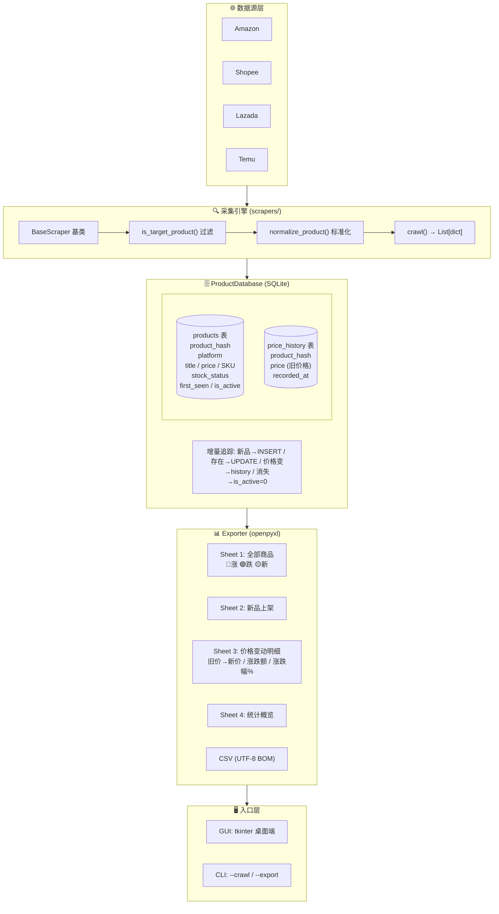
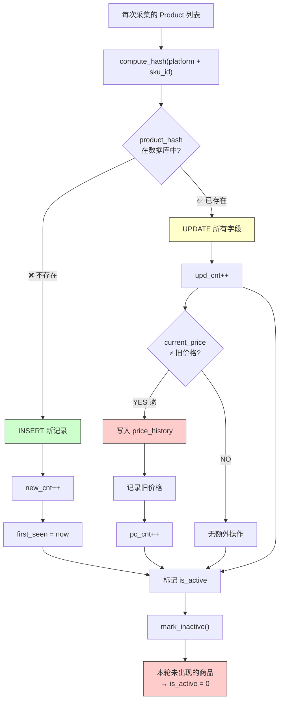

<p align="center">
  
  
  
  
</p>

<p align="center">
  <h1 align="center">🛒 EcomPulse — 跨境电商竞品数据监控系统</h1>
  <p align="center"><em>Competitor Price & Product Monitor for Cross-Border E-Commerce</em></p>
</p>

---

## 📖 这是什么？

**EcomPulse** 是一款开源的跨境电商竞品监控桌面工具。它能自动采集多个电商平台（Amazon、Shopee、Lazada、Temu）的商品数据，实时追踪价格变动，检测新品上架和商品下架，并生成带颜色高亮的 Excel 报表。

---

## ✨ 核心功能

| 功能 | 说明 |
|:---|:---|
| 🔍 **多平台采集** | 支持 Amazon / Shopee / Lazada / Temu，可通过配置扩展 |
| 💰 **价格变动检测** | 每次采集自动对比 `current_price`，变动商品写入 `price_history` 历史表 |
| 🆕 **新品上架提醒** | 首次发现的商品自动标记为"新品上架"，Excel 整行黄色高亮 |
| 📉 **下架自动检测** | 本轮未出现的商品自动标记 `is_active=0`，不再出现在活跃列表中 |
| 📊 **4 Sheet Excel 报表** | 全部商品 / 新品上架 / 价格变动明细 / 统计概览 |
| 🎨 **智能颜色编码** | 涨价 🔴 红色 / 降价 🟢 绿色 / 新品 🟡 黄色 / 缺货预警 |
| ⏰ **定时采集** | 支持每天 / 每12小时 / 每6小时自动运行 |
| 🖥️ **桌面 GUI** | tkinter 本地界面，双击即用，无需浏览器 |
| 🛡️ **反检测策略** | Playwright Stealth + 代理支持 + Amazon 验证页自动绕过 |
| 📦 **一键打包 EXE** | PyInstaller 打包成独立可执行文件，无需安装 Python |

---

## 🚀 快速开始

### 方式一：下载 EXE（推荐，无需 Python）

从 [Releases](../../releases) 下载 `EcomPulse.zip`，解压后双击 `竞品监控.exe`。

### 方式二：从源码运行

```bash
# 1. 克隆项目
git clone https://github.com/Aaron-Bushnell/ecompulse.git
cd ecompulse

# 2. 安装依赖
pip install -r requirements.txt
playwright install chromium

# 3. 启动 GUI
python main.py

# 或命令行模式
python main.py --crawl    # 无头采集 + 导出
python main.py --export   # 仅导出已有数据
```

### 配置代理（采集 Amazon 需要）

编辑 `ecompulse/core/config.py`：

```python
PROXY_HOST = "your-proxy-host"
PROXY_PORT = "8080"
PROXY_USER = "username"
PROXY_PASS = "password"
```

推荐 [Webshare](https://www.webshare.io)（$2.99/月起）或 [Bright Data](https://brightdata.com)。

---

## 🏗️ 技术架构



### 增量追踪与价格监控机制



---

## 📂 项目结构

```
ecompulse/
├── main.py                           # 入口 (CLI + GUI)
├── build_exe.py                      # PyInstaller 打包脚本
├── requirements.txt                  # Python 依赖
│
├── ecompulse/                        # 核心包
│   ├── __init__.py
│   ├── gui.py                        # tkinter 桌面端
│   ├── core/
│   │   ├── config.py                 # 平台 / 代理 / 过滤配置
│   │   ├── database.py               # ProductDatabase (SQLite)
│   │   ├── crawler.py                # 采集编排 (爬虫工厂)
│   │   ├── exporter.py               # Excel + CSV 导出
│   │   └── scrapers/
│   │       ├── __init__.py           # get_scraper 注册表
│   │       ├── base.py               # BaseScraper 基类
│   │       └── amazon_scraper.py     # Amazon (Playwright + Proxy)
│   └── utils/
│       └── encoding.py               # Windows GBK 终端修复
│
├── tests/
│   └── test_core.py                  # 18 个单元测试
│
└── data/                             # SQLite 数据库 & 导出文件
```

---

## 🔧 扩展新平台

1. 在 `config.py` 的 `PLATFORMS` 中注册
2. 新建 `scrapers/xxx_scraper.py`，继承 `BaseScraper`
3. 实现 `crawl(log_func) → List[dict]`
4. 在 `scrapers/__init__.py` 中注册到 `_SCRAPER_REGISTRY`

```python
# 示例：添加 Shopee 爬虫
# ecompulse/core/scrapers/shopee_scraper.py
class ShopeeScraper(BaseScraper):
    def crawl(self, log_func=print):
        # ... 采集逻辑
        return [self.normalize_product(...)]

# ecompulse/core/scrapers/__init__.py
from ecompulse.core.scrapers.shopee_scraper import ShopeeScraper
_SCRAPER_REGISTRY["shopee"] = lambda: ShopeeScraper()
```

---

## 🧪 运行测试

```bash
pytest tests/ -v
# 18 passed — 覆盖 BaseScraper / ProductDatabase / Config
```

---

## 📊 数据模型

### products 表

| 字段 | 类型 | 说明 |
|:---|:---|:---|
| `product_hash` | TEXT UNIQUE | MD5(platform + sku_id) |
| `platform` | TEXT | 电商平台标识 |
| `product_title` | TEXT | 商品标题 |
| `current_price` | REAL | 当前售价 |
| `original_price` | REAL | 划线原价 |
| `currency` | TEXT | 货币单位 (USD/CNY/...) |
| `sales_volume` | INTEGER | 销量 |
| `review_count` | INTEGER | 评价数 |
| `rating` | REAL | 评分 (0-5) |
| `sku_id` | TEXT | SKU / ASIN |
| `stock_status` | TEXT | in_stock / low_stock / out_of_stock / pre_order |
| `listing_date` | TEXT | 上架日期 |
| `first_seen` | TEXT | 首次监控时间 |
| `is_active` | INTEGER | 1=在售, 0=已下架 |

### price_history 表

| 字段 | 说明 |
|:---|:---|
| `product_hash` | 关联 products |
| `price` | 变动前的旧价格 |
| `recorded_at` | 变动时间 |

---

## 🖥️ 桌面端截图

> *启动 `python main.py` 即可看到 tkinter GUI，包含平台多选、搜索框、采集按钮、Treeview 结果表格、定时采集设置和实时日志。*

---

## 📋 变更历史

详见 [CHANGELOG.md](CHANGELOG.md)

| 版本 | 日期 | 要点 |
|:---|:---|:---|
| 2.0.0 | 2026-06 | 重构为竞品监控系统，新增价格变动检测、4 Sheet Excel、代理支持 |
| 1.0.0 | 2026-06 | 首个开源版本 |

---

## 📄 许可证

MIT License © 2026 Aaron Bushnell

---

## ⭐ Star History

如果你觉得这个项目有用，欢迎给个 Star ⭐

---

---

# 🇬🇧 English

## What is EcomPulse?

**EcomPulse** is an open-source desktop tool for cross-border e-commerce competitor monitoring. It automatically scrapes product data from multiple platforms (Amazon, Shopee, Lazada, Temu), tracks price changes in real time, detects new listings and delistings, and generates color-coded Excel reports.


## Key Features

| Feature | Description |
|:---|:---|
| 🔍 **Multi-Platform Scraping** | Amazon / Shopee / Lazada / Temu, extensible via config |
| 💰 **Price Change Detection** | Compares `current_price` on each crawl, writes old price to `price_history` |
| 🆕 **New Product Alerts** | Auto-marks first-seen products, highlights entire row in yellow |
| 📉 **Delisting Detection** | Products not found in current crawl → `is_active=0` |
| 📊 **4-Sheet Excel Report** | All Products / New Arrivals / Price Changes / Stats Overview |
| 🎨 **Color Coding** | Price up 🔴 Red / down 🟢 Green / new 🟡 Yellow |
| ⏰ **Scheduled Crawling** | Daily / 12h / 6h auto-run |
| 🖥️ **Desktop GUI** | Native tkinter interface, no browser required |
| 🛡️ **Anti-Detection** | Playwright Stealth + proxy support + Amazon verification bypass |

## Quick Start

```bash
git clone https://github.com/Aaron-Bushnell/ecompulse.git
cd ecompulse
pip install -r requirements.txt
playwright install chromium
python main.py
```

## Architecture

```
Data Sources → Scrapers (Playwright + Stealth) → ProductDatabase (SQLite)
→ Exporter (openpyxl 4-sheet Excel) → GUI / CLI
```

The core innovation is the **price change detection** built into `upsert_products()`: each crawl compares `current_price` against the database value, and on mismatch, records the old price into `price_history` while updating the product record. This enables full price trend analysis over time.

## Tech Stack

- **Python 3.10+** with `tkinter` for GUI
- **Playwright** + `playwright-stealth` for browser automation
- **SQLite** for local persistence (products + price_history tables)
- **openpyxl** for formatted Excel export with conditional coloring
- **PyInstaller** for standalone EXE packaging

## License

MIT — see [LICENSE](LICENSE)
